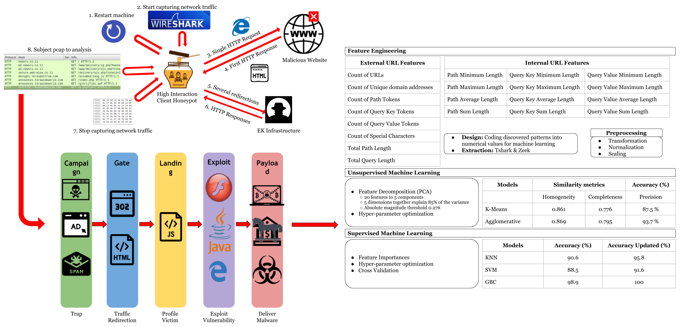

<!-- A bit of  HTML code for formatting. The rest is expected to be written in markdown. -->

<h1 align="center" position="relative">
   
  
   
   
  Research Title
   

  <!-- Below, there are some small button-like images. These are called "badges" and are popular on Github. You can create your own or edit the ones below. They are useful for adding quick links to external files or to add badges for your project. Each one consists of a link (`<a href=..`) and an `` tag. Edit the link to point to where you want. Delete the badges that you don't need. -->

  

  <a href="https://www.overleaf.com/read/...">
    <!-- You can edit the `Overleaf-paper` part in the next link to change the text of the created badge. -->
    
  </a>

  

  

  

  

   
</h1>

  <!-- The README template for projects at the Royal Hacking Lab -->

## Table of contents
- [Table of contents](#table-of-contents)
- [Quick Info](#quick-info)
- [Template](#template)
- [Description](#description)

## Quick Info

- **Team**
  - Supervisor: [Dr. Emre Süren](https://github.com/beyefendi)
  - Active members: [Adam](link-to-online-profile) | [Eva](link-to-online-profile)
  - Past members: [Sonson](link-to-online-profile)
- **Timeline**
  - Status: running :green_circle: (or pending :yellow_circle:, completed :orange_circle:)
  - Started: 2029-12
  - Ended: 2030-05
- **Parent project:** [LLM Security | Vulnerability Researh | Digital Forensics](link-to-umbrella-project)
- **Abstract:**
The prevalence and non-stop evolving technical sophistication of Exploit Kits (EKs) is one of the most challenging shifts in the modern cybercrime landscape. Over the last few years, malware infection via drive-by download attacks have been orchestrated with EK infrastructures. An EK serves various types of malicious content via several threat vectors for a variety of criminal attempts, which are mostly monetary-centric. In this research, an in-depth discussion of the EK philosophy and internals is provided. A content analysis is introduced for the EK families where special context-aware properties are identified. A key observation is that while the webpage contents have drastic differences between distinct intrusions executed through the same EK, the patterns in URL addresses stay similar. This is due to the fact that auto-generated URLs by EK platforms follow specific templates. This paper proposes a new lightweight technique to quickly categorize unknown EK families with high accuracy leveraging machine learning algorithms with novel URL features. Rather than analyzing each URL individually, the proposed overall URL patterns approach examines all URLs associated with an EK infection. The method has been evaluated with a popular and publicly available dataset that contains 240 different real-world infection cases involving over 2250 URLs, the incidents being linked with the 4 major EK flavors that occurred throughout the year 2016. In the experiments, the system achieves up to 93.7 % clustering accuracy and up to 100 % classification accuracy with the estimators experimented.

**Delete below from your repo**

## Template

This README is meant as a common template for all RHL projects. If you have suggestions, create a [new
issue](https://github.com/cybercampus-se/project-template/issues/new) or [pull
request](https://github.com/cybercampus-se/project-template/pull/new).

To use this skeleton repository as a template for your project, simply create your repository and select this repo as the template:

## Description

We use a GitHub [organization](https://github.com/cybercampus-se) account to keep track of research artifacts generated during study at 
 Royal Hacking Lab ([RHL](https://lab.cybercampus.se)). 
- Issues to keep track of the
pending work 
- Projects to group issues and create milestones
- Comments for discussion (Discuss your ideas in Slack then summaries it in discussion)
- Teams to mange project mambers
- Keep in the repor: code, tex documents, small files

**Do not delete below from your repo**

 

  

- - - -
This project run by the [Royal Hacking Lab](https://lab.cybercampus.se) within the [Cybercampus Sverige](https://cybercampus.se)
